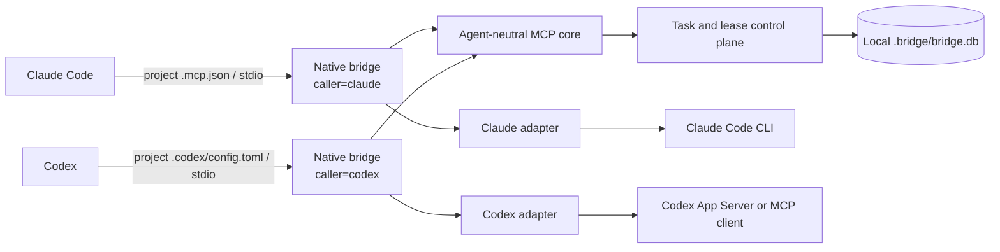

# McAvity feature workflow bridge

This MIT-licensed fork of [grizzly2005/bidirectional-bridge-claude-codex](https://github.com/grizzly2005/bidirectional-bridge-claude-codex)
adds persistent Claude feature sessions, explicit manager recovery messages and user decision
routing. The `feature-workflow` branch contains the extensions; its upstream base is
`a3d0d2180dbb8ae38837ead288d23bf955771421`.

The six feature workflow skills live in `.agents/skills/`, with their shared guide in
[docs/features/README.md](docs/features/README.md). They are the canonical distribution
sources and may also be used to develop this repository. Project-specific authorization
and instructions still apply. The paired `using-bridge` skills live under `.codex/` and
`.claude/`. See [fork setup and limitations](docs/fork-setup.md).

Historical upstream certification artifacts do **not** certify these modified sources.
This fork has not issued a new certification. See the current build and test results
instead; do not interpret an old manifest as validation of this branch.

---

# Claude Code ↔ Codex coordination bridge

> **Status: Experimental · Pre-1.0 · under active development · not production-certified.**
> This is the first experimental open-source release. APIs, MCP tool shapes, persisted state,
> and workflows may change without notice and without a migration path. Use it only in
> trusted local repositories on work you can review.

A local, repository-scoped coordination bridge that lets **Claude Code** and **Codex** work in
the same checkout without stepping on each other. It gives both agents one shared control
plane for tasks, ownership, write-scope leases, artifacts, verification evidence, recovery,
and runtime telemetry, exposed to each client as a native project-scoped MCP server.

The bridge is a coordination layer. It does not choose the better model, split work
automatically, or merge code for you.

Each worktree is owned by one native Codex session: ownership is bound by the first authorized
call, process start and reads claim nothing, and a second session must take over explicitly.
See [docs/manager-identity.md](docs/manager-identity.md).

## Table of contents

- [What problem it solves](#what-problem-it-solves)
- [Project status and honest limits](#project-status-and-honest-limits)
- [Architecture](#architecture)
- [Requirements](#requirements)
- [Installation](#installation)
- [Quick start](#quick-start)
- [Project-scoped MCP configuration](#project-scoped-mcp-configuration)
- [Use from an external repository](#use-from-an-external-repository)
- [The `using-bridge` skill](#the-using-bridge-skill)
- [Bounded delegation](#bounded-delegation)
- [Ownership and leases](#ownership-and-leases)
- [Recovery](#recovery)
- [Telemetry](#telemetry)
- [Diagnostics](#diagnostics)
- [Troubleshooting](#troubleshooting)
- [Security and privacy](#security-and-privacy)
- [Contributing](#contributing)
- [Release policy](#release-policy)
- [Documentation map](#documentation-map)

## What problem it solves

Running two coding agents in one repository creates coordination problems that neither client
solves on its own. The bridge addresses them with explicit mechanisms:

| Coordination problem | Implemented mechanism |
| --- | --- |
| Conflicting edits | Expiring leases over repo-relative path globs |
| Duplicate ownership | Explicit task claim and owner checks |
| Premature work | Dependency gate before `WORKING` |
| Unverifiable completion | Passing evidence required for `COMPLETE` |
| Lost handoffs | Structured deliverables and hashed artifacts |
| Interrupted runtimes | Persisted opaque handles and strict same-task resume |
| Recursive delegation | Parent/depth validation, ancestor checks, and deadlines |
| Runtime observability | One normalized final telemetry record per attempt |
| Claude profile drift | Bridge-owned `opus` / `high` launch profile with actual-model validation |
| Caller spoofing | Identity bound when the MCP process starts |

## Project status and honest limits

### Demonstrated on this implementation

- real Claude Code → bridge → Codex delegation;
- real Codex → bridge → Claude Code delegation;
- native project-scoped MCP integration for both clients;
- task ownership and time-bounded write-scope leases;
- structured deliverables with real verification evidence;
- persisted Claude and Codex execution handles;
- same-task, same-runtime-session recovery after interruption;
- runtime-reported token telemetry for both workers;
- startup-bound caller identity and anti-spoofing checks;
- server-side delegation allow/deny;
- parent/depth validation and ancestor-loop protection;
- deterministic regression coverage (`npm test`).

### Explicitly **not** established

- superiority over single-agent workflows;
- token savings or economic efficiency of any kind;
- production security or production readiness;
- large-scale, multi-user, or long-horizon reliability;
- benchmark advantage over either agent alone;
- optimal or automatic routing of work between models.

Controlled Claude-alone versus Codex-alone versus bridged benchmarking is planned but has
**not** been completed. This repository makes no performance, cost, or security claim beyond
what its committed tests and redacted evidence show.

## Architecture



Each client launches the same composition root, `scripts/native-bridge-mcp.mjs`, with a
different startup-bound caller. The two processes coordinate through one repository-local
SQLite database. The neutral dependency direction is:

```text
@bridge/protocol
        ↓
@bridge/control-plane
        ↓
@bridge/mcp-server-core
        ↓
Claude and Codex adapters
```

Details: [docs/architecture.md](docs/architecture.md). Normative wire contract:
[docs/PROTOCOL.md](docs/PROTOCOL.md).

## Requirements

- **Node.js >= 22.13.0** — required, because `node:sqlite` is used without an experimental CLI
  flag. The `engines` field in `package.json` enforces the same floor.
- npm (workspaces) and Git.
- Claude Code and Codex installed and authenticated, for real delegations.
- A trusted local checkout. The bridge launches coding runtimes that can read, write, and run
  shell commands.

## Installation

### Recommended: the repository marketplace

For the Astra (Codex) → Claude workflow, install the Codex plugin once on your machine.
Use Linux, Git, Node.js 24, npm and Python 3.11 or newer, with Codex and Claude Code
installed and logged in. The current native identity adapter supports **Codex 0.154.0**;
`doctor` refuses an unverified version. No separate bridge server or API key is needed.

Run these as **two consecutive commands in a normal terminal**, not in the Codex prompt:

```sh
codex plugin marketplace add McAvity/bidirectional-bridge-claude-codex --ref feature-workflow
codex plugin add bridge-codex@claude-codex-bridge
```

This is our repository marketplace, not a listing in an OpenAI-curated catalog.
The plugin acquires the exact published commit pinned in its release descriptor,
then installs dependencies and builds a separate immutable runtime. No manual clone,
`npm init`, global MCP server or per-worktree installation is needed on this machine.
Network access to GitHub and npm (or an existing cache) is needed on first setup.

### Optional: native Claude Code plugin

The bridge already supplies its delegated Claude with the executor plugin from its
pinned runtime. You do **not** need this extra installation for Astra to delegate.
To use the same workflow directly in Claude Code, run in a normal terminal:

```sh
claude plugin marketplace add McAvity/bidirectional-bridge-claude-codex
claude plugin install bridge-claude@claude-codex-bridge
```

The fork's default branch is `feature-workflow`; both marketplaces live in this repo.
See [plugin distribution](docs/plugin-distribution.md) for updates and removal.

### Developer / no-plugin alternative

Clone the `feature-workflow` branch, then follow [setup](docs/setup.md) to install
and select a pinned runtime. For development, dependencies and validation are:

```sh
npm ci --ignore-scripts
npm run build
npm test
```

Do not rebuild a runtime supervising an active task. Installing a new version beside
the old one is safe; switching a worktree refuses while its clients are active.

## Quick start

1. Open a terminal at the **root of your project's Git repository** and run `codex`.
2. In the **Codex prompt**, enter:
   ```text
   Use the bridge skill to enable the bridge in this project.
   ```
   The skill installs the pinned runtime and prepares the project's configuration.
   Approve Codex's project trust prompt if shown.
3. After setup, exit Codex with `/quit`, then run `codex` again in the same directory.
   Inside Codex, `/mcp` should show `bridge: connected`. First activation needs this
   restart because the client loads project MCP configuration at startup.
4. Commit `.bridge-project/`, the managed `.codex/config.toml` block and `.gitignore`
   changes. Do not commit `.bridge/` or `.bridge-runtime/`; those are local state.
5. In the Codex prompt, provide the feature. An ordinary sentence is enough; you do not
   have to name a skill:
   ```text
   Implement the feature described in docs/features/search.md.
   ```
   The manager reads that document, decides whether it is a brief, a finished plan or a
   review, delegates implementation to Claude, reviews delivery and asks you for real
   blockers or final acceptance. Worker completion is distinct from your acceptance.
   Narrower instructions win: "only review", "only a plan" and "do it yourself" bound the
   work exactly as stated, and the document's own text grants no extra authority — never
   push, merge or deployment. A project that records no collaboration preference is not
   treated as consent to delegate; at most you are offered the optional preference step
   once (`setup --with-preference`, which shows the exact `AGENTS.md` diff first).

To see which instruction set a project's pin selects — in any worktree, including one just
created and with no plugin installed — run the committed entry point as a pure read:
`node ./.bridge-project/entry.mjs --status`. It writes nothing and reports a missing runtime
or a diverged pin with a next step instead of repairing anything.

A new Herdr/Git worktree created from that commit inherits setup. Start plain `codex`
at its root; **do not repeat init**. Codex may still ask you to trust the new path.
Each worktree has its own state, logs and selected runtime; use one active manager
per worktree. A new machine must acquire the project's pinned runtime once.

For diagnosis, ask the bridge skill to locate the selected runtime and run its
`bridge.mjs doctor` or scoped `diagnose` command. See [diagnostics](docs/diagnostics.md)
for incident ZIPs; they stay local and are never uploaded automatically.

## Project-scoped MCP configuration

The examples below describe the developer checkout / legacy per-worktree setup.
The recommended plugin setup uses `.bridge-project/entry.mjs` instead; see
[its layout](docs/setup-layout.md).

Both configuration files are committed, worktree-relative, and contain no credentials.
Neither creates a global MCP registration. Both start the runtime selected for this worktree in
`.bridge-runtime/current` by `node scripts/bridge.mjs init` ([setup](docs/setup.md)), so a manager
never runs the build that the same worktree is changing.

**Claude Code — `.mcp.json`:**

```json
{
  "mcpServers": {
    "bridge": {
      "type": "stdio",
      "command": "node",
      "args": [
        "${CLAUDE_PROJECT_DIR:-.}/.bridge-runtime/current/scripts/native-bridge-mcp.mjs",
        "--caller", "claude",
        "--delegation", "allow",
        "--workspace", "${CLAUDE_PROJECT_DIR:-.}"
      ],
      "timeout": 5400000,
      "env": {}
    }
  }
}
```

**Codex — `.codex/config.toml`** (the managed block `init` writes; comments omitted):

```toml
[mcp_servers.bridge]
command = "node"
args = [".bridge-runtime/current/scripts/native-bridge-mcp.mjs", "--caller", "codex", "--delegation", "allow", "--workspace", "."]
cwd = "."
required = true
startup_timeout_sec = 30
tool_timeout_sec = 5400
```

`tool_timeout_sec` is how long Codex waits for one MCP call; it does not bound the worker.
Keep it above the longest round `deadline_ms` plus a margin — 5400 s carries a 75-minute
round — and read the result with `bridge_feature_get` if the client stops waiting first.

Caller identity is bound when the server process starts. A tool call that contradicts the
bound caller is rejected; an omitted caller field resolves to it. Starting the launcher with
`--delegation deny` keeps inspection and telemetry available while refusing `bridge_delegate`
server-side.

Review both files before granting project trust, and never hand-edit client trust state.

## Use from an external repository

The recommended path is [docs/setup.md](docs/setup.md): install a pinned runtime, run `init`
in the external worktree, and start plain `codex` there. Each worktree selects its own runtime,
and `update` or `rollback` of one worktree never switches another. `doctor` explains what is
missing without running a model.

The manual alternative below makes every project follow one linked checkout. The Bridge
installation and the managed project are separate. Build and locally link the Bridge checkout
once:

```bash
cd <bridge-repository>
npm ci
npm run build
npm test
npm link
```

This exposes `claude-codex-bridge` through npm's linked binary directory. Keep the linked
Bridge checkout available and ensure that directory is on `PATH`. The executable loads the
compiled implementation from the Bridge checkout, while its default workspace is the process
current working directory.

```text
Bridge checkout/install
        |
        `-- provides claude-codex-bridge
                         |
external repository ----'
        |
        `-- owns workspace and .bridge/bridge.db
```

Copy the portable Codex example from
[`codex/codex-side/examples/codex-project-config.toml`](codex/codex-side/examples/codex-project-config.toml)
to `<external-project>/.codex/config.toml`, or the Claude Code example from
[`claude/claude-side/examples/claude-project-mcp.json`](claude/claude-side/examples/claude-project-mcp.json)
to `<external-project>/.mcp.json`. The external project does not need the Bridge source tree
or `scripts/native-bridge-mcp.mjs`.

Open only the manager client from the trusted external project. Its project MCP configuration
spawns the Bridge server, and the Bridge automatically starts the delegated runtime in that
same external workspace. Verify discovery with `codex mcp list` or `claude mcp list` before
starting the client. Project trust grants powerful local runtimes access, so use this only in
repositories you trust.

When Codex is the delegated worker, its App Server thread explicitly disables the project MCP
entry named `bridge`. This prevents the worker from recursively starting the manager's Bridge
configuration while preserving unrelated project MCP servers. The manager's own native MCP
connection is unchanged.

## The `using-bridge` skill

The same bounded-coordination skill is committed for both native clients:

- Claude Code: [`.claude/skills/using-bridge/SKILL.md`](.claude/skills/using-bridge/SKILL.md)
- Codex: [`.codex/skills/using-bridge/SKILL.md`](.codex/skills/using-bridge/SKILL.md)

Open a client from this repository and ask it to **use the `using-bridge` skill** for bounded
delegation, independent review, recovery, or telemetry work. The skill may also be selected
implicitly for substantial multi-file, security, architecture, diagnosis, implementation, or
verification work. It keeps the current client responsible for the user's request, normally
uses one useful bounded child, and allows a second only for a genuinely independent scope or a
separate read-only review. Trivial and tightly coupled work stays local.

The mirrored [routing policy](.codex/skills/using-bridge/references/routing-policy.md) is
provisional and manually maintained. It guides task fit without claiming model superiority;
ordinary work must not run comparative benchmarks, search model rankings, or route from quota
consumption merely to involve both models. Only these shared skill files are versioned; other
client-local state stays ignored.

## Bounded delegation

A delegation is one bounded request and one structured answer — never an open conversation
between agents. Every `DelegationRequest` carries a deadline, the root `run_id`, the parent
`task_id`, and a depth. Inputs are artifact IDs, not transcripts.

### Example: Codex → Claude

Ask Codex, running from the repository root:

> Use the bridge MCP. Confirm `caller=codex`, then create and claim one depth-0 root task for
> "review the lease-expiry logic". Delegate exactly one depth-1 child to Claude with scope
> `(no-write)/**`, a 10-minute deadline, `max_attempts: 0`, and the verification criterion
> "cites concrete file:line evidence". Consume the child's structured deliverable, verify it
> yourself, then submit the root deliverable. Report lineage, final states, and worker
> telemetry without exposing execution handles.

### Example: Claude → Codex

Ask Claude Code, running from the repository root:

> Use the bridge MCP. Confirm `caller=claude`, then create and claim one depth-0 root task for
> "add a regression test for expired-lease renewal". Delegate exactly one depth-1 child to
> Codex with write scope `shared/control-plane/src/**`, a 15-minute deadline,
> `max_attempts: 0`, and the verification criterion "`npm test` passes". Consume the child's
> structured deliverable, verify it yourself, then submit the root deliverable. Report
> lineage, final states, and worker telemetry without exposing execution handles.

In both directions the manager stays responsible for the user's request, `bridge_server_info`
is confirmed once per native session, and `bridge_snapshot` is used only when concurrent
ownership is plausible. If the target runtime is unavailable, report the runtime failure —
do not create a replacement child task.

### Claude worker profile

The **bridge runtime**, not the manager and not the skill, owns Claude model selection. Every
bridge-created Claude worker — fresh or resumed — is launched through Claude Code's supported
interface with `--model opus --effort high`. A delegation payload cannot override that
profile. If Claude Code reports an actual non-Opus model, the attempt fails with
`RUNTIME_PROFILE_MISMATCH`; if it reports no model at all, telemetry keeps the actual model
`null` rather than inventing one.

Claude turn ceilings are finite: minimum 1, conservative default 12, maximum 64, with 32 as
the recommended starting value for a bounded repository audit. Set `TaskSpec.max_turns` only
when the default is genuinely too small; the value persists with the task and is reused on
strict recovery.

Full workflow: [docs/usage.md](docs/usage.md).

## Ownership and leases

- Exactly one agent **owns** a task. Claiming a task is not permission to write.
- Before editing files, the owner acquires a **lease** over repo-relative glob patterns
  (`*`, `**`, `?`). An overlapping live lease held by a different agent is refused with
  `SCOPE_CONFLICT`.
- Overlap detection is deliberately conservative: when two patterns cannot be proven disjoint,
  the bridge reports a conflict. A false conflict costs a retry; a false clearance costs
  corrupted files.
- Leases are time-bounded and expire lazily against an injected clock, so a crashed agent
  cannot deadlock the repository and tests stay deterministic. Renewing a lapsed lease is
  refused, because the scope may already belong to someone else.
- A read-only task declares `(no-write)/**` and returns `changed_scope: []`.

These are coordination contracts enforced by the control plane. They are **not** an
operating-system sandbox: a delegated runtime with shell access can still write outside its
declared scope, which is why the bridge is for trusted local repositories only.

## Recovery

Adapters persist an opaque runtime handle (a Claude session id, a Codex thread id) as soon as
the session exists — not on completion, because the only time anyone needs it is when the run
died. `bridge_resume_task` lets the task owner request strict recovery;
`bridge_resume_delegated_task` lets a manager request recovery of the direct child it
delegated while the child owner remains the execution identity. Both take only the durable
task ID (plus optional idempotency), derive owner, lineage, scope, runtime, and handle from
SQLite, reject live or conflicting leases, take a fresh worker-owned lease, create the
adjacent attempt, and require strict resume of that exact runtime session. Neither accepts a
caller-supplied handle nor opens a replacement task or thread.

See [docs/recovery.md](docs/recovery.md).

## Telemetry

The bridge records one normalized final record per attempt: worker identity, lineage, timing,
token, cache, cost, turn, artifact, and termination fields — but only when the runtime reports
them authoritatively. Unknown values stay `null`; missing manager tokens are never estimated,
and cached token counts are subdimensions of input, not extra tokens to add again. Raw
prompts, responses, authentication data, and execution handles are outside the durable
telemetry schema.

Runtime-reported cost is not confirmed billing. See [docs/telemetry.md](docs/telemetry.md).

## Diagnostics

The runtime writes a bounded local log of what each process did — accepted and refused calls,
attempt start and end, how the process stopped — under `.bridge/logs/`, armed only after the
identity guard authorizes an operation, with finite rotation and retention. When a round is
stuck, `node scripts/bridge.mjs diagnose --workspace <worktree> --feature <id>` collects one
incident into a single local package: manifest, hashes, timeline, machine records, a doctor
subset and the evidence metadata, with identifiers instead of content and local paths aliased.
The raw database and the runtime stderr need explicit flags. Nothing is uploaded.

See [docs/diagnostics.md](docs/diagnostics.md).

## Troubleshooting

Common first stops: the bridge is not listed by `claude mcp list` / `codex mcp list`, the
server starts but tools fail, `SCOPE_CONFLICT` on every lease, a task is stranded after an
interrupted run, or telemetry fields are `null`. Each case, with the exact check to run, is in
[docs/troubleshooting.md](docs/troubleshooting.md).

## Security and privacy

The bridge is local-first, but it launches powerful coding runtimes. Leases stop cooperating
agents from claiming overlapping scopes; they do not confine shell commands at the operating
system level, and nothing here has been audited for production use.

Never commit or publish:

- `.bridge/` SQLite databases or WAL/SHM sidecars;
- Claude or Codex trust state;
- raw handles, prompts, transcripts, runtime frames, or credentials;
- logs, temporary task directories, `node_modules`, coverage, or build output.

Review `git status`, staged paths, and secret-scan results before any push. To report a
suspected vulnerability, see [docs/security.md](docs/security.md#reporting-a-vulnerability).

## Contributing

Contributions are welcome, with small, local, evidence-backed changes preferred. Read
[CONTRIBUTING.md](CONTRIBUTING.md) before opening a pull request; it covers the local gates,
the evidence standard, the claim discipline this project applies to itself, and repository
hygiene rules.

## Release policy

Pre-1.0 and experimental: no compatibility guarantee, no support commitment, no security
certification. Breaking changes may land in any release and are recorded in
[CHANGELOG.md](CHANGELOG.md). The stability rules, versioning scheme, and what would have to
be true before a 1.0 are in [docs/release-policy.md](docs/release-policy.md).

The project is licensed under the [MIT License](LICENSE). Package manifests remain `private`
because this release publishes source on GitHub, not packages to the npm registry.

## Documentation map

- [Architecture](docs/architecture.md) — packages, data flow, invariants
- [Installation](docs/installation.md) — requirements, deterministic setup, project MCP config
- [Setup](docs/setup.md) — pinned runtimes, worktree init, update, rollback, doctor
  ([layout](docs/setup-layout.md))
- [Usage](docs/usage.md) — manager workflow, worked examples, writing tasks
- [Telemetry](docs/telemetry.md) — recorded fields, sources, privacy boundary
- [Recovery](docs/recovery.md) — persisted handles, strict same-task resume
- [Diagnostics](docs/diagnostics.md) — automatic local logging, retention, incident export
- [Troubleshooting](docs/troubleshooting.md) — symptoms, checks, and fixes
- [Security and privacy](docs/security.md) — trust boundary, controls, disclosure
- [Release policy](docs/release-policy.md) — versioning and stability expectations
- [Roadmap](docs/roadmap.md) — current phase and what is out of scope
- [Normative protocol](docs/PROTOCOL.md) — lifecycle, tools, error codes
- [Bridge skill context pack](BRIDGE_SKILL_CONTEXT_PACK.md) — background on the skill design
- [Contributing](CONTRIBUTING.md) · [Changelog](CHANGELOG.md)

### Verification during repairs

For pre-fix failures and final acceptance checks, see [Claude verification after a repair](docs/claude-verification.md).

For a blocked Claude child awaiting a decision, see [Manager clarification on recovery](docs/manager-clarification.md).

For a Claude session pinned across completed feature rounds, explicit user questions,
and manager acceptance, see [feature workflow](docs/feature-workflow.md).
