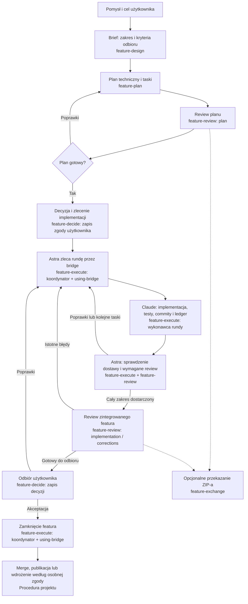

# Od pomysłu do odebranego featura

Przewodnik użytkownika: jak prowadzić feature i zlecać jego implementację Astrze
(Codex), która koordynuje Claude’a przez bridge. Szczegółowe reguły znajdują się
we [wspólnym workflow](features/README.md); ten opis jest mapą procesu, nie nowym
zestawem bramek ani zgód.

## Cały proces

Nazwy pod krokami wskazują używane skille, a nie obowiązkowe polecenia do wpisania.
`feature-decide` zapisuje decyzję — nie zastępuje zgody użytkownika. Przerywane
strzałki oznaczają opcjonalną wymianę przez `feature-exchange`, np. przy review
bez dostępu do repo; eksport można też zlecić w innym momencie.

Diagram pokazuje normalny przebieg. Rzeczywista blokada może pojawić się na każdym
etapie; jej obsługę opisano niżej. Review zintegrowanej dostawy może być jednocześnie
review ostatniej rundy — diagram nie wymaga dwóch identycznych kontroli.

## 1. Pomysł → brief

Opisujesz problem, oczekiwany efekt i ograniczenia. `feature-design` pomaga ustalić
zakres, rzeczy wyłączone i sprawdzalne kryteria odbioru. Wynikiem jest zwykle
`docs/features/<id>/brief.md`. Jeśli masz już uzgodniony brief, pomijamy tę fazę.

Przy dużym projekcie najpierw podziel zakres na feature’y dostarczające spójną wartość.
Szczegółowo planuj najbliższy wykonalny etap; późniejszych nie trzeba rozpisywać,
jakby wszystkie niewiadome były już rozstrzygnięte.

Przykład polecenia:

> Pomóż mi opisać feature: użytkownik zapisuje notatkę i później odnajduje ją przez
> wyszukiwanie. Ustalmy zakres i kryteria odbioru, bez implementacji.

## 2. Brief → plan, taski i decyzja

`feature-plan` sprawdza repozytorium i przygotowuje `design.md`, taski oraz indeks
`feature.json`. Jeśli projekt używa Yumi, wykorzystuje istniejące zadania i ich
statusy; feature grupuje cel i kryteria, a taski opisują pracę potrzebną do ich
realizacji. Nie tworzymy drugiego konkurencyjnego backlogu. Bez Yumi wystarczą
zadania Markdown zgodne z konwencją projektu.

`feature-review` sprawdza wykonalność planu, zależności i pokrycie wymagań.
`feature-decide` zapisuje rzeczywistą decyzję użytkownika lub decyzję w granicach
jawnie delegowanego uprawnienia. Zatwierdzenie planu i zlecenie implementacji to
różne czynności, ale można zawrzeć je w jednej wiadomości. Nie trzeba ponownie
potwierdzać już udzielonej zgody.

> Przygotuj plan i taski dla docs/features/F-001-notes/brief.md, a następnie
> przejrzyj plan. Nie zaczynaj jeszcze implementacji.

## 3. Zlecenie → praca Astry i Claude’a

Najpierw [zainstaluj i skonfiguruj bridge oraz skille](../README.md#installation).
W przygotowanym worktree uruchom zwykły `codex`. Nie trzeba ręcznie utrzymywać
osobnego serwera: klient uruchamia projektowy serwer MCP. Dla równoległych
feature’ów używaj oddzielnych worktree, z osobnym stanem i sesją managera.

Gdy plan jest uzgodniony, wystarczy polecenie w naturalnym języku:

> Zaimplementuj docs/features/F-001-notes/ przez bridge: Claude implementuje,
> Ty koordynujesz i robisz review. Dokończ uzgodniony zakres z poprawkami
> i lokalnymi commitami. Bez push, merge i wdrożenia.

Nie trzeba wymieniać nazw skilli w każdym zleceniu. Astra korzysta z
`feature-execute` jako koordynator i z `using-bridge` do obsługi delegacji.
Claude korzysta z roli wykonawcy rundy w `feature-execute`.

| Rola | Odpowiedzialność |
| --- | --- |
| Użytkownik | Cel, istotne decyzje produktowe, budżet i końcowy odbiór |
| Astra | Podział na rundy, kontrakty, zależności, sprawdzenie dostaw, niezależne review, decyzje i kontynuacja |
| Claude | Praca w zakresie kontraktu, testy, lokalne commity i zapis wykonania (ledger) |
| Bridge | Trwały stan, tożsamość i własność, uruchamianie jawnie zleconych rund, powiązanie sesji i wyniki |

Bridge sam nie planuje, nie recenzuje i nie podejmuje decyzji o następnej rundzie.
Robi to Astra. Po ukończonej rundzie kolejny task lub poprawka trafia do tej samej
natywnej sesji Claude’a. Zablokowany task jest wznawiany jako ten sam task,
zgodnie z [regułami recovery](recovery.md).

Dostawą są commity i ledger w repozytorium. Astra sprawdza ich bazę, zakres,
dowody i dostarczoną wersję kodu. `feature-exchange` służy do opcjonalnego ZIP-a,
np. dla reviewera bez dostępu do repo, albo na wyraźne żądanie. Nie jest wymagany
po każdym tasku. Kontrakty wystawione pod starszym runtime nadal obowiązują
w swojej pierwotnej postaci, także jeśli wymagają ZIP-a.

## 4. Oczekiwanie, review i poprawki

Astra czeka na dostawę bez podglądania roboczych plików i recenzowania każdej edycji.
Preferuje wynik oczekującego wywołania; jeśli musi sprawdzać stan, robi to domyślnie
najwyżej raz na 10 minut. Jawne polecenie użytkownika lub konkretny błąd może
uzasadniać wcześniejszy odczyt. Oczekiwanie nie kończy zlecenia.

Domyślnie obowiązują kontrole dostawy i review rund opisane w
[procedurze koordynatora](../.agents/skills/feature-execute/references/bridge-loop.md).
Inną granulację review, np. jedno review zintegrowanej implementacji po kilku
taskach, trzeba uzgodnić jawnie; nie usuwa to kontroli pochodzenia dostawy ani
koniecznych bramek kontraktowych. Testy Claude’a nie zastępują niezależnego review.

Zwykłe poprawki w uzgodnionym zakresie i kolejne gotowe taski nie wymagają nowej
zgody. Astra kontynuuje do dostarczenia zakresu lub rzeczywistej blokady, zamiast
kończyć turę komunikatem „uruchomiłem Claude’a”. Przy trzecim review tego samego
problemu powinna ocenić, czy podejście nadal prowadzi do celu i czy da się je
uprościć. Nie oznacza to zgody na pominięcie istotnego błędu.

## 5. Pytanie, przerwanie lub restart

Przed pytaniem blokującym Astra kończy prace niezależne od odpowiedzi. Stan
`waiting_user` zamraża dalsze rundy tego featura. Pytanie trafia do Ciebie;
Twoja odpowiedź nie jest automatycznie przekazywana Claude’owi. Astra zapisuje
ją i jawnie przekazuje potrzebną decyzję w kolejnym kontrakcie lub wznowieniu.

Przy utracie odpowiedzi, capacity lub restarcie możesz napisać „kontynuuj”.
Astra najpierw odczytuje zapisany stan i zbiera istniejącą dostawę albo czeka na
trwającą rundę; nie uruchamia zastępczej pracy w ciemno. „Kontynuuj” nie jest
odpowiedzią na nierozstrzygnięte pytanie produktowe ani zwiększeniem budżetu.

Bridge nie wzbudza zamkniętej Astry i nie uruchamia automatycznie `/goal`.
Po zamknięciu klienta wznów dokładną sesję managera. Timeout klienta nie dowodzi,
że Claude się zatrzymał; szczegóły diagnozy są w [recovery](recovery.md) i
[dokumentacji diagnostyki](diagnostics.md).

## 6. Gotowy wynik → odbiór i zamknięcie

Astra przedstawia wynik względem kryteriów, commity, review, wykonane testy oraz
rzeczy niezweryfikowane. Wymagane testy na urządzeniu, brak danych czy budżetu
pozostają otwartymi warunkami; ukończenie dostępnej części nie zamyka całego featura.

Rozróżniamy trzy fakty:

- **Claude ukończył rundę** — dostawa wykonawcy, jeszcze nie odbiór featura.
- **Review PASS** — sprawdzony zakres spełnia wymagania w granicach dowodów.
- **Akceptacja użytkownika** — zapisana decyzja o odbiorze; dopiero wtedy Astra
  zamyka feature przez bridge, chyba że wcześniej jawnie delegowano jej odbiór.

Merge, publikacja wersji i wdrożenie mają własny zakres autoryzacji. Mogą być już
zlecone, ale sama akceptacja lokalnej implementacji nie oznacza ich wykonania.

## Gdzie szukać szczegółów

- [Wspólny workflow i układ plików](features/README.md) — skille, taski, dowody i decyzje.
- [Techniczny workflow bridge’a](feature-workflow.md) — narzędzia, stany i kanały.
- [Tożsamość managera](manager-identity.md) — własność worktree i wznowienie.
- [Setup](setup.md) — szczegóły instalacji przypiętego runtime.
- [README](../README.md) — instalacja z marketplace i mapa dokumentacji.
